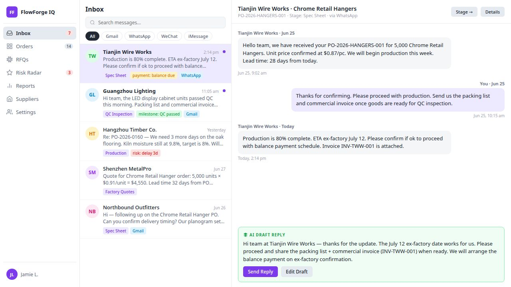
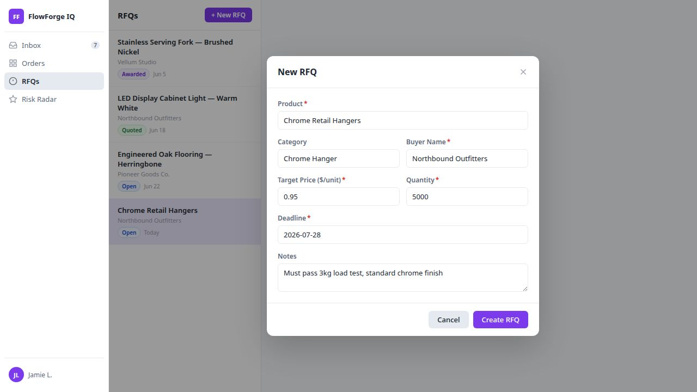
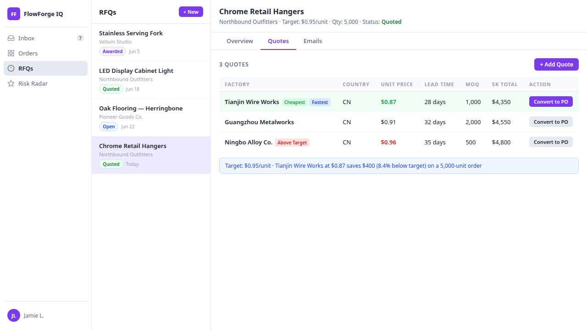
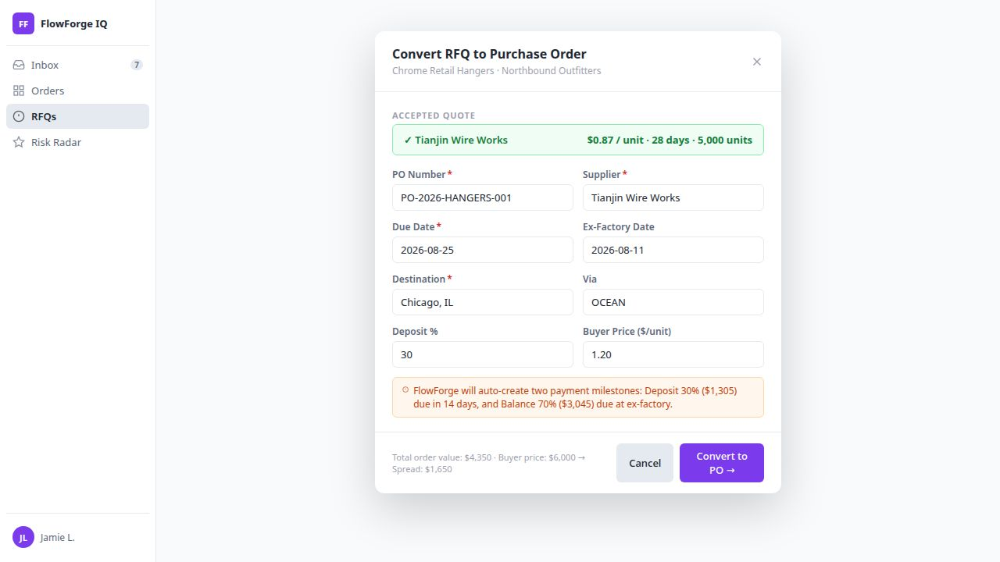
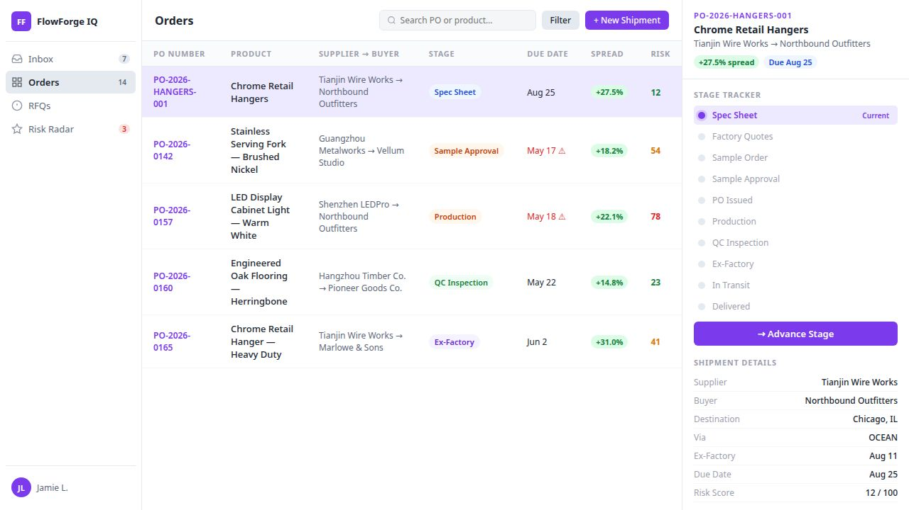
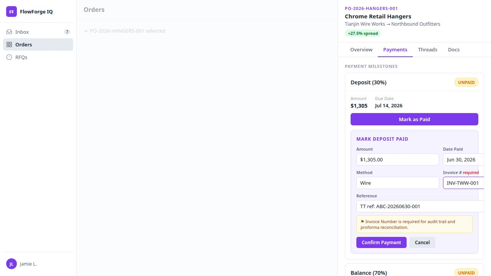
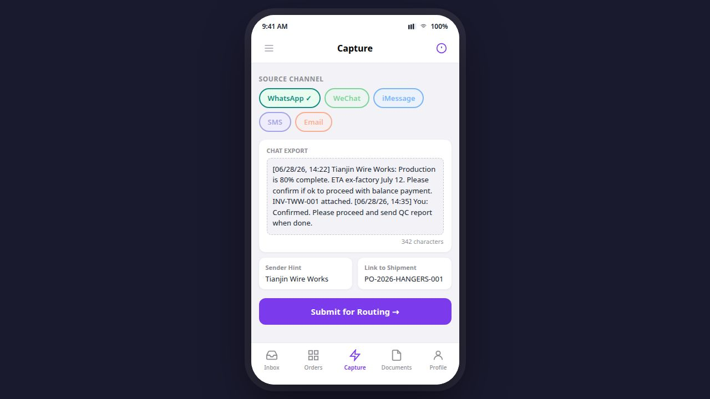
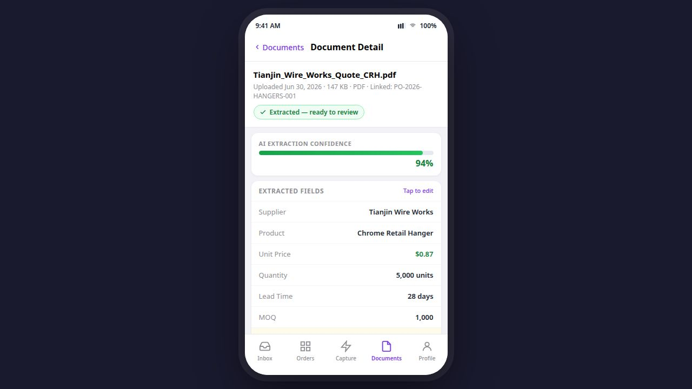

# RFQ-to-Shipment Walkthrough Guide

**Scenario:** Chrome Retail Hangers — Tianjin Wire Works → Northbound Outfitters  
**Audience:** New team members completing their first full procurement cycle  
**Time:** ~30–45 minutes for a first run; ~15–20 minutes for repeat sessions  
**Prerequisites:** A FlowForge account with sign-in access to flowforgeiq.com and the FlowForge Mobile app installed on your phone

---

## Overview

This guide walks you through the complete FlowForge workflow, from creating an RFQ through to uploading a supplier document on mobile. By the end, you will have created a live PO for Chrome Retail Hangers, compared three factory quotes, converted the winner to a shipment, logged a payment milestone, routed a supplier chat from your phone, and uploaded a quote document.

| Part | Screen | What you do |
|------|--------|-------------|
| 1 | Inbox | Orient yourself — navigation, filters, AI tags |
| 2 | RFQs → New RFQ Modal | Create the RFQ for Chrome Retail Hangers |
| 3 | Quotes Tab → Add Quote | Add three factory quotes |
| 4 | Quotes Comparison Table | Compare and pick Tianjin Wire Works |
| 5 | Convert-to-PO Dialog | Convert the winning quote to a live PO |
| 6 | Orders Grid + Detail Panel | Track stage progression and spread badge |
| 7 | Payment Milestones | Log the 30% deposit payment |
| 8 | Mobile — Capture Tab | Paste and route a WhatsApp chat export |
| 9 | Mobile — Documents Tab | Upload a quote PDF and review extraction |

---

## Part 1 · Getting Oriented

**Screen:** Inbox (default home page)



After signing in at [flowforgeiq.com](https://flowforgeiq.com), you land on the **Inbox**. This is the unified message feed for all supplier communications across every channel.

### Steps

1. **Identify the left sidebar** — the navigation icons from top to bottom are: Inbox (home), Orders, RFQs, Copilot, Risk Radar, Settings.
2. **Scan the filter pills** at the top of the message list: All · Gmail · WhatsApp · WeChat · iMessage. Click any pill to scope the list to that channel.
3. **Click a message row** — the right panel opens showing the full conversation thread.
4. **Find the AI draft reply** below the thread — FlowForge pre-writes a response based on the message content. Edit it or send as-is.
5. **Look at the AI tags** beneath each snippet: these labels (e.g. `risk: delay 2d`, `payment: balance due`, `milestone: production`) are auto-generated and tell you what action is needed.

### What to notice

- **Unread messages** have a bold sender name and a blue left border.
- **Supplier avatars** are clickable — they open the supplier's full history and linked shipments.
- The **stage pill** on each message shows which shipment stage it belongs to, so you can instantly triage by urgency.

> **Tip:** Use the search bar (top of the inbox) to filter by supplier name, PO number, or shipment. This is the fastest way to find a specific message thread when you have dozens of open POs.

---

## Part 2 · Create the RFQ

**Screen:** RFQs → New RFQ Modal



### Steps

1. Click **RFQs** in the left sidebar to open the RFQ Manager.
2. Click the blue **+ New RFQ** button in the top-right corner of the RFQ list.
3. Fill in the form with the following values:

| Field | Value | Required |
|-------|-------|----------|
| Product | Chrome Retail Hangers | ✓ |
| Category | Chrome Hanger | |
| Buyer Name | Northbound Outfitters | ✓ |
| Target Price | $0.95 per unit | ✓ |
| Quantity | 5,000 units | ✓ |
| Deadline | 4 weeks from today | ✓ |
| Notes | Must pass 3kg load test, standard chrome finish | |

4. Click **Create RFQ** — the new RFQ appears selected in the left panel with status **Open**.

### What to notice

- The **buyer name combobox** supports typing a new name or selecting from existing buyers.
- **Target price** is the anchor for the comparison table — FlowForge uses it to compute savings percentages and "above target" warnings.
- **Draft autosaves** to session storage — you can refresh the page without losing your progress.
- The RFQ starts with status **Open**. As you add quotes it becomes **Quoted**, and after converting it becomes **Awarded**.

---

## Part 3 · Add Three Quotes

**Screen:** Quotes Tab → Add Quote Modal



With the Chrome Retail Hangers RFQ selected, you will add three factory quotes.

### Steps

1. Click the **Quotes** tab in the right panel (next to Overview).
2. Click **+ Add Quote** to open the modal.
3. Add each of the following three quotes:

**Quote 1 — Tianjin Wire Works**

| Field | Value |
|-------|-------|
| Factory Name | Tianjin Wire Works |
| Country | CN |
| Unit Price | $0.87 |
| Lead Time | 28 days |
| MOQ | 1,000 |
| Notes | Existing supplier — fastest turnaround |

**Quote 2 — Guangzhou Metalworks**

| Field | Value |
|-------|-------|
| Factory Name | Guangzhou Metalworks |
| Country | CN |
| Unit Price | $0.91 |
| Lead Time | 32 days |
| MOQ | 2,000 |
| Notes | Mid-range price, higher MOQ |

**Quote 3 — Ningbo Alloy Co.**

| Field | Value |
|-------|-------|
| Factory Name | Ningbo Alloy Co. |
| Country | CN |
| Unit Price | $0.96 |
| Lead Time | 35 days |
| MOQ | 500 |
| Notes | Above target price — low MOQ |

4. Click **Add Quote** after each entry. Repeat for all three factories.

### What to notice

- Quote status defaults to **received**. The other option is **pending** (for quotes still outstanding from the factory).
- After all three are added, the RFQ status advances from **Open** to **Quoted**.
- You can edit or delete any quote using the icons on each quote row.

---

## Part 4 · Compare Quotes & Pick a Winner

**Screen:** Quotes Comparison Table


The comparison table makes the right choice obvious.

### Steps

1. Review the **comparison table** — quotes are sorted by unit price ascending (cheapest first).
2. Look for the auto-assigned badges:
   - **Cheapest** (green) — lowest unit price
   - **Fastest** (blue) — shortest lead time
   - **Above target** (red) — unit price exceeds your target
3. Check the **spread vs. target price** column — Tianjin Wire Works at $0.87 beats the $0.95 target by 8.4%, saving $400 on this order.
4. Click **Convert to PO** on the Tianjin Wire Works row.

### What to notice

- The **above target** badge on Ningbo Alloy ($0.96) is a deliberate signal — FlowForge flags it automatically so you don't have to calculate manually.
- The comparison is per-unit and for the full order total — both columns are shown side by side.
- Convert to PO is a **one-way action** — it creates a shipment and marks the RFQ as Awarded.

---

## Part 5 · Convert to PO

**Screen:** Convert-to-PO Dialog



### Steps

1. In the dialog, confirm **Tianjin Wire Works** is selected as the accepted quote.
2. Fill in:

| Field | Value | Required |
|-------|-------|----------|
| PO Number | PO-2026-HANGERS-001 | ✓ |
| Supplier | Tianjin Wire Works | ✓ |
| Due Date | 8 weeks from today | ✓ |
| Ex-Factory Date | 6 weeks from today | ✓ |
| Destination | Chicago, IL | ✓ |
| Via | OCEAN | |
| Deposit % | 30 | |

3. Click **Convert** — FlowForge creates the shipment and marks the RFQ as **Awarded**.
4. A toast confirms: `PO PO-2026-HANGERS-001 created — shipment is now live`.

### What to notice

- **Ex-factory date** is typically 1–2 weeks before the due date to allow for ocean transit.
- FlowForge **auto-creates two payment milestones**: Deposit (30% = $1,305) and Balance (70% = $3,045).
- After converting, you can optionally click **Download Proforma PDF** to export a formatted proforma invoice.
- The RFQ status changes to **Awarded** and the RFQ list shows a green badge.

---

## Part 6 · Track the Shipment

**Screen:** Orders Grid + Shipment Detail Panel



### Steps

1. Click **Orders** in the left sidebar. Locate **PO-2026-HANGERS-001** in the grid — it may be at the top if sorted by date.
2. Click the shipment row to open the detail panel on the right.
3. Review the header: current stage (**Spec Sheet**), supplier (Tianjin Wire Works), buyer (Northbound Outfitters), due dates, and the **spread badge**.
4. To advance the stage: click the **→ Advance Stage** button in the detail panel header.
5. Confirm the stage transition in the dialog — optionally add a note.
6. The stage tracker updates and a new event appears in the **Stage History** tab.

### What to notice

- **Spread badge** color: green = positive margin (buyer price > cost), red = underwater. It recalculates automatically as payments are logged.
- **Risk score** (0–100) appears in the right column of the orders grid — driven by overdue payments, delayed stages, and unread critical messages.
- Each stage advance is **timestamped and recorded** in Stage History — this is your audit trail.
- The detail panel has three tabs: **Threads** (messages linked to this PO), **Docs** (documents), and **Quotes** (factory quotes from the original RFQ).

### Stage progression reference

```
Spec Sheet → Factory Quotes → Sample Order → Sample Approval →
PO Issued → Production → QC Inspection → Ex-Factory →
In Transit → Payment Clearance → Delivered
```

---

## Part 7 · Log a Payment

**Screen:** Shipment Detail Panel → Payment Milestones



### Steps

1. In the shipment detail panel, scroll to the **Payments** section (or click the Payments tab if shown).
2. Find the **Deposit (30%) — $1,305** milestone row. It shows status **Unpaid** and the due date.
3. Click **Mark as Paid** on the deposit row.
4. Fill in the Mark Paid form:

| Field | Value | Notes |
|-------|-------|-------|
| Amount | $1,305 | Pre-filled from the milestone |
| Date Paid | Today | Use the date picker |
| Payment Method | Wire | Other options: PayPal, Letter of Credit, Cash |
| Invoice Number | INV-TWW-001 | **Required** — used for audit trail |
| Reference | Your bank TT reference | Optional but recommended |

5. Click **Confirm** — the milestone turns **green** and the balance due updates.

### What to notice

- **Invoice Number is required** — enforce this in real usage. It's the reconciliation anchor for finance audits.
- After marking paid: the **spread badge recalculates** automatically. The outstanding balance (Balance 70% = $3,045) is now the only unpaid milestone.
- You can **undo** immediately after marking paid if you made an error.
- The payment is logged with a timestamp in the stage history.

---

## Part 8 · Mobile — Paste a Supplier Chat

**Screen (Mobile):** FlowForge Mobile → Capture Tab → Routing Result



> **📱 Mobile steps** — open the FlowForge Mobile app on your phone.

### Steps

1. Open **FlowForge Mobile** on your iOS or Android device.
2. Tap the **Capture** tab (lightning bolt icon) at the bottom navigation bar.
3. **Select your channel** — tap the **WhatsApp** pill in the Source Channel row.
4. Export a WhatsApp chat:
   - Open WhatsApp on your phone
   - Long-press the factory conversation
   - Tap **More → Export Chat → Without Media**
   - Share the exported `.txt` to FlowForge — it auto-pastes into the text field
   - *Alternative:* manually paste a realistic chat excerpt, e.g.:
     ```
     [06/28/26, 14:22] Tianjin Wire Works: Production is 80% complete.
     ETA ex-factory: July 12. Please confirm if OK to proceed.
     ```
5. Optionally: enter a **Sender Hint** (e.g. `Tianjin Wire Works`) and link to the **Chrome Retail Hangers** shipment using the Shipment picker.
6. Tap **Submit for Routing** — the AI engine analyses the message.
7. On the **Routing Result** screen:
   - Review the **confidence score** (green bar = high confidence)
   - Check the matched shipment — it should link to your new PO
   - Tap **Confirm & Save**
8. The message now appears in the **web Inbox**, linked to PO-2026-HANGERS-001.

### Routing result states

| Confidence | State | Action |
|-----------|-------|--------|
| ≥ 75% | Auto-routed (green header) | Tap **Confirm & Save** |
| 40–75% | Possible match (amber header) | Confirm or tap **Pick another** |
| < 40% | Needs review (red header) | Pick a shipment manually or **Send to web queue** |

### What to notice

- The **AI Draft Reply** appears below the routing result — FlowForge pre-writes a factory response. This draft syncs to the web Inbox.
- Confirming on mobile sends the message to the web Inbox **instantly** — open the web app to verify.
- If the factory message contains a new ex-factory date, FlowForge extracts it and suggests a stage advance.

---

## Part 9 · Mobile — Upload a Document

**Screen (Mobile):** FlowForge Mobile → Capture Tab → Documents Tab → Document Detail



> **📱 Mobile steps** — continue in the FlowForge Mobile app.

### Steps

1. In the **Capture** tab, tap the **File** button (paperclip icon) in the Attach row.
2. Pick a quote PDF, packing list, or proforma from your phone's Files app.
   - *If you don't have a real document:* use any PDF — the extraction will still demonstrate the workflow.
3. The file appears as an attachment card below the text area.
4. Optionally link it to the **Chrome Retail Hangers** shipment using the Shipment picker.
5. Tap **Submit for Routing** — the document is uploaded and AI extraction begins.
6. Tap the **Documents** tab (file icon) in the bottom navigation bar.
7. Find your new upload in the list — status shows **Processing** then updates to **Extracted**.
8. Tap the document card to open **Document Detail**.
9. Review the AI-extracted fields:

| Field | Expected Value |
|-------|---------------|
| Supplier | Tianjin Wire Works |
| Product | Chrome Retail Hanger |
| Unit Price | $0.87 |
| Quantity | 5,000 units |
| Lead Time | 28 days |
| Document Type | Proforma Invoice / Quote |

10. If any field is wrong, tap it and edit inline.
11. Tap **Save Corrections** — the verified document is now linked to your PO and appears in the web Orders → Docs tab.

### Document status reference

| Status | Meaning |
|--------|---------|
| Processing | AI extraction in progress (usually < 10 seconds) |
| Extracted | Fields parsed — review and correct as needed |
| Unmatched | No shipment linked — assign manually |
| Failed | Extraction error — review the document manually |

### What to notice

- **Confidence percentage** (e.g. 94%) is shown on the detail screen — higher is better. Below 70%, review all fields carefully.
- **Inline corrections** you make teach the extraction model over time — correction quality improves with usage.
- After saving: the document appears in the **web Inbox → Docs tab** and in **Orders → PO detail → Docs tab**, linked to PO-2026-HANGERS-001.

---

## Walkthrough Complete

You have now run the full Chrome Retail Hangers procurement scenario:

1. ✅ **RFQ created** — Chrome Retail Hangers, Northbound Outfitters, $0.95 target
2. ✅ **Three quotes added** — Tianjin Wire Works, Guangzhou Metalworks, Ningbo Alloy Co.
3. ✅ **Winner selected** — Tianjin Wire Works ($0.87 — beats target by 8.4%)
4. ✅ **PO created** — PO-2026-HANGERS-001, ex-factory 6 weeks, destination Chicago
5. ✅ **Stage tracked** — from Spec Sheet, advanced through the lifecycle
6. ✅ **Deposit logged** — $1,305 paid, invoice INV-TWW-001 recorded
7. ✅ **Mobile chat routed** — WhatsApp export linked to the correct shipment
8. ✅ **Document uploaded** — quote PDF extracted and corrections saved

Every step you completed here is what your team will do on live POs. The only difference in production is that the supplier names, PO numbers, and document contents will be real.

---

## Screenshots Reference

Screenshots of each major screen are saved in `docs/screenshots/`. The same images are embedded in the corresponding slides in the FlowForge Sales Playbook (slides 18–26).

| File | Part | Screen |
|------|------|--------|
| `walkthrough-cover.jpg` | Cover | Walkthrough cover slide with scenario and 9-part roadmap |
| `part1-inbox-overview.jpg` | Part 1 | Inbox with step-by-step key actions and what-to-notice callouts |
| `part2-create-rfq.jpg` | Part 2 | New RFQ form with all fields filled for Chrome Retail Hangers |
| `part3-add-quotes.jpg` | Part 3 | Three quotes entered: Tianjin, Guangzhou, Ningbo |
| `part4-compare-quotes.jpg` | Part 4 | Quotes comparison with cheapest/fastest/above-target badges |
| `part5-convert-to-po.jpg` | Part 5 | Convert-to-PO dialog with all fields |
| `part6-track-shipment.jpg` | Part 6 | Stage tracker at Spec Sheet, what-to-notice notices |
| `part7-log-payment.jpg` | Part 7 | Payment milestones with deposit and balance, Mark Paid form |
| `part8-mobile-chat.jpg` | Part 8 | Mobile Capture tab with channel picker and routing result states |
| `part9-mobile-document.jpg` | Part 9 | Mobile Document Detail with extracted fields and status badges |

---

## Troubleshooting

**I can't find Northbound Outfitters in the buyer dropdown.**  
Type the name directly — the buyer combobox accepts new entries. The buyer will be created when you save the RFQ.

**The routing result shows low confidence.**  
This is expected if the pasted text doesn't contain a PO number or supplier name matching your data. Use the Shipment picker to link it manually, then tap Confirm & Save.

**The document status stays on "Processing".**  
Wait 10–30 seconds and pull to refresh the Documents tab. If it stays on Processing, tap the document card — you can manually enter the fields even before extraction completes.

**The spread badge shows red (negative margin).**  
This means the logged payment total exceeds the buyer price set on the deal. Check the deal buyer price in the shipment detail panel → Spread section.
